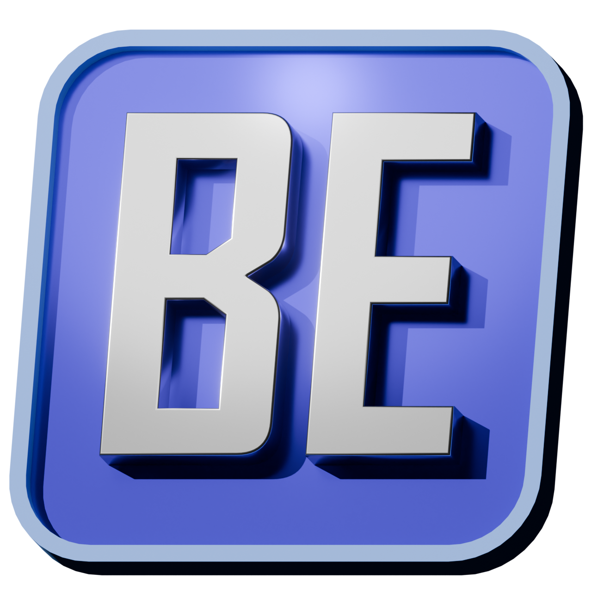

  

# BigEngine
BigEngine is a cross-platform, 2D and 3D game engine written in C# and Raylib. A side project I'll hopefully finish one day.

## Planned Features

✔ = implemented ❌ = not yet implemented

- ✔ <b>Free and Open Source:</b> Donate by buying it on Steam in the future!
- ✔ <b>Cross-Platform:</b> Editor and builds will work fine on Windows, MacOS, and Linux, not sure about the other ones Raylib supports.
- ✔ <b>Uses Raylib:</b> Uses [Raylib](https://raylib.com/) under the hood
- ✔ <b>Ease of use:</b> Designed for <b>beginner</b> to <b>intermediate</b> developers, but still being as flexible as possible for <b>advanced</b> developers.
- ✔ <b>2D + 3D:</b> Supports 2D and 3D project types.
- ❌ <b>VR Support:</b> Pretty good VR support.
- ❌ <b>Object Layering:</b> Good object organization abilities using layers similar to drawing programs.
- ❌ <b>Lighting:</b> Several built-in options for lighting:
  - ❌ [Gouraud](https://en.wikipedia.org/wiki/Gouraud_shading): For a nostalgic feel.
  - ✔ [Phong](https://en.wikipedia.org/wiki/Phong_shading): The previous industry standard, to my knowledge.
  - ✔ [Blinn-Phong](https://en.wikipedia.org/wiki/Blinn%E2%80%93Phong_reflection_model): The industry standard rasterizer reflection model.
  - ❌ [PBR](https://en.wikipedia.org/wiki/Physically_based_rendering): Physically based rendering using the <b>Metallic</b> workflow.
  - ❌ [Radiance Cascades](https://radiance-cascades.com/): A new-ish realtime GI technique. 
  <b>These include the options for both forward and deferred rendering.</b>
- <b>Post processing:</b> Several built-in options for post processing:
  - ❌ [Bloom](https://en.wikipedia.org/wiki/Bloom_(shader_effect))
  - ❌ [Chromatic aberration](https://en.wikipedia.org/wiki/Chromatic_aberration)
  - ❌ [Color balance](https://en.wikipedia.org/wiki/Color_balance)
  - ❌ [Depth of Field](https://en.wikipedia.org/wiki/Depth_of_field)
  - ❌ [Dithering](https://en.wikipedia.org/wiki/Dither)
  - ❌ [Fisheye lens](https://en.wikipedia.org/wiki/Fisheye_lens)
  - ❌ [Film grain](https://en.wikipedia.org/wiki/Film_grain)
  - ❌ [HSV adjustment](https://en.wikipedia.org/wiki/HSL_and_HSV)
  - ❌ [Pixelization](https://en.wikipedia.org/wiki/Pixelization)
  - ❌ [Color Quantization](https://en.wikipedia.org/wiki/Color_quantization)
  - ❌ [Vignetting](https://en.wikipedia.org/wiki/Vignetting)
- ❌ <b>Good GUI:</b> A nice, slick GUI across the software, while not being a cluttered nightmare for beginners.
- ❌ <b>Visual Scripting:</b> An interesting take on visual scripting inspired by [CTF2.5](https://www.clickteam.com/clickteam-fusion-2-5), also interchangeable with C#.
- ❌ <b>Shader nodes:</b> Easy to use, [Blender](https://www.blender.org/)-like shader nodes which generate object/post processing shaders, also interchangeable with GLSL.
- ❌ <b>Customizable:</b> Several options to change the look/feel of the editor.
- ❌ <b>Basic Modelling Tools:</b> A basic menu to create 3D meshes.
- ❌ <b>Extensions:</b> Supports extensions to add to the editor.
- ✔ <b>Lightweight:</b> No setup .msi, no required dependencies, no useless (AI) features. Instantly get it up and running.

## Setup Instructions
### Normal setup
(NOTE: NOT RELEASED YET)
To start using BigEngine, go to the Releases tab and download the latest zip with your OS's name on it, extract it, and open it up.
### Compilation steps coming later.

---

### Footnotes
This project was developed by a self-taught amateur. Expect bad code please.
If you'd like to contribute, feel free! :)
